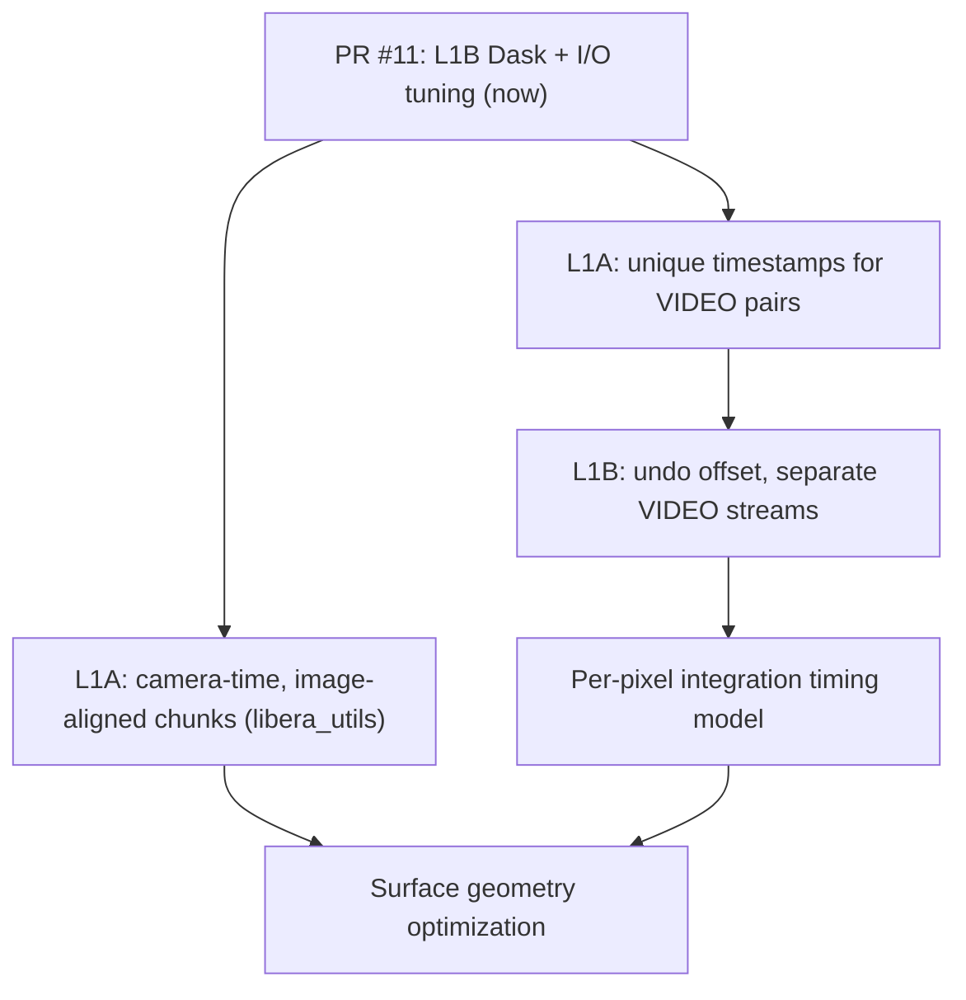

# libera_cam L1B Roadmap

High-level plan for WFOV camera L1B processing beyond the current performance work
([PR #11](https://github.com/LASP-Libera/libera_cam/pull/11)). This document captures
known upstream dependencies, open design questions, and expected sequencing. It is
intentionally forward-looking; items here are not commitments for any single release.

**Related documentation**

- [overview.md](overview.md) — L1B pipeline usage, manifest configuration, and Dask parallelization
- [wfov_fsw_header_reference.md](wfov_fsw_header_reference.md) — FSW metadata, `img_mode`, VIDEO
  pairing, and duplicate-timestamp behavior
- [changelog.md](changelog.md) — shipped changes by version

---

## Current Dask Baseline (PR #11)

Recent work on `feature/kim-speed-up` improves L1B throughput on today's L1A products:

- Batch JPEG-LS decompression with pre-chunked Dask arrays in `read_l1a_cam_data.py`
- Configurable Dask execution via environment variables (`DASK_SCHEDULER`, `DASK_NUM_WORKERS`,
  `DASK_MEMORY_LIMIT`, `LIBERA_CAM_CHUNK_SIZE`); see [overview.md](overview.md) for operator guidance
- NetCDF compression from libera_utils product-definition enforcement (no runtime encoding dict
  in `write_data_product`)
- Pytest integration helpers: `make_extended_l1a` (`tests/helpers/l1a_scaling.py` +
  `tests/conftest.py` fixture) for larger L1A fixtures; `tests/integration/test_l1b_profiling.py`
  for diagnostic Dask profiling smoke tests in CI

These optimizations help within the constraints described below. Several roadmap items
require L1A product or metadata changes in **libera_utils** before L1B can fully benefit.

---

## 1. Camera-time L1A with image-aligned chunking

### Problem today

L1A WFOV science products arrive as a **CCSDS mem-dump packet stream** indexed by
`PACKET_ICIE_TIME`, not by image acquisition time. Each complete NAND image blob may span
many packets. At L1B, `read_l1a_cam_data.py` must:

1. Scan the packet stream (`reassemble_image_blobs`)
2. Stitch SOP/EOP sequences into image blobs
3. Decompress JPEG-LS payloads
4. Build a `camera_time`-indexed dataset

Packet-boundary chunking does **not** align with image boundaries. A Dask chunk can start or
end mid-image, which prevents clean parallel decomposition and forces stitching work inside
the L1B algorithm.

See [L1A time coordinates](wfov_fsw_header_reference.md#l1a-time-coordinates) for the
distinction between `PACKET_ICIE_TIME` and `CAMERA_TIME`.

### Target state

Move blob reassembly (and maybe decompression) into the **libera_utils L1A pipeline**. Future L1A
products should be:

- Indexed on **`camera_time`** (or an equivalent per-image coordinate)
- Written in **chunks that contain only complete images**

### Expected L1B impact

With image-aligned L1A chunks, L1B can:

- Skip packet stitching entirely
- Map Dask blocks directly to image groups
- Parallelize radiometric correction and geolocation with fewer graph nodes and less
  scheduler overhead

### Open questions

- Chunk size policy (images per chunk vs. target byte size)
- Whether decoded 12-bit arrays or compressed payloads are stored at L1A
- Should L1A files be only complete images or can incomplete images be on the edges?

---

## 2. VIDEO mode and duplicate `camera_time` values

### Problem today

When the FPGA runs in **VIDEO** mode (`img_mode == 1`), a single camera trigger produces
**two NAND images** with identical FSW timestamps: a full-frame write (bitmask bypass) and a
masked/stripe write. Both share the same `timestamp_seconds` and `timestamp_subseconds`, so
`camera_time` is **not unique**.

Duplicate time coordinates break many NetCDF viewers and complicate any logic that assumes
one row per acquisition instant. See
[Images per timestamp](wfov_fsw_header_reference.md#images-per-timestamp) and
[Separating duplicate-timestamp pairs](wfov_fsw_header_reference.md#separating-duplicate-timestamp-pairs).

### Proposed L1A fix

Introduce a small synthetic sub-microsecond offset (on the order of **1 µs**) within each
duplicate-timestamp pair so that stored coordinates are unique and monotonic in packet
order. The offset is a **storage convenience**, not a physical acquisition-time correction.

Document the offset scheme in the L1A product definition and propagate a flag or auxiliary
coordinate so downstream code can recover the true trigger time.

### L1B responsibilities

| Step                   | Requirement                                                                                                                        |
| ---------------------- | ---------------------------------------------------------------------------------------------------------------------------------- |
| Geolocation input time | **Undo** the synthetic offset before SPICE lookups so pointing uses the true trigger time                                          |
| Product separation     | Split VIDEO pairs into distinct logical streams (e.g. science still vs. video full-frame); exact output schema **not yet decided** |
| Validation             | Use packet order, `img_mode`, and content heuristics (`valid_pixel_mask`, `integration_mask`) to confirm pair assignment           |

Candidate stream names from the FSW reference doc: **ScienceStill** (masked member of each
VIDEO pair plus non-VIDEO frames) and **VideoFull** (full-frame member only).

### Open questions

- Whether L1B emits separate products, separate variables within one product, or filters one
  stream at write time
- How to represent the "true" vs. "storage" timestamp in L1B output metadata
- Whether all VIDEO frames in a sequence need splitting or only `img_mode == 1` pairs

---

## 3. Per-pixel integration time and geolocation time

### Problem today

Each downlinked pixel is encoded as **13 bits** in the JPEG-LS payload:

- **Bits 0–11**: DN value (12-bit science data)
- **Bit 12**: integration-time flag (short vs. long exposure)

The camera acquires **two images at different integration times** within a single readout
cycle. Pixels from the short and long integrations therefore correspond to **different
effective acquisition times**, even though they share one `camera_time` coordinate and one
FSW header timestamp.

L1B already extracts the per-pixel flag as `integration_mask` in `l1a_parser.py` and uses it
for radiometric calibration (`convert_dn_to_radiance`). Geolocation, however, still
evaluates SPICE at the **frame-level** `camera_time` for all pixels in the image.

### Target state

Accurate geolocation requires knowing **when each pixel was effectively exposed**. At minimum:

1. Model the short/long integration timing relative to the frame timestamp (exposure start,
   readout order, and any known FPGA timing offsets)
2. Assign a per-pixel or per-integration-group time array for SPICE interpolation
3. Apply the correct time when computing lat/lon/alt (and any surface geometry angles) for
   each pixel

### Likely work areas

- Instrument timing reference from FSW/FPGA documentation (`commanded_exp_time_1/2` in the
  FSW header may be inputs)
- Decide whether geolocation runs per integration class (two SPICE solves per frame) or with
  a full per-pixel time grid
- Coordinate with the VIDEO/timestamp work (item 2) so time corrections are applied in the
  right order
- Product-definition updates if per-pixel time or integration-specific geometry fields are
  written to L1B output

### Status

Approach is **not fully defined**. This item is a prerequisite for science-grade geolocation
on dual-integration data.

---

## 4. Surface geometry geolocation performance

### Problem today

Sub-satellite geolocation (lat/lon/alt via SPICE ray–ellipsoid intersection) is already the
dominant cost for large products. Adding **surface geometry** angles — solar zenith, viewing
zenith, relative azimuth, and related fields at each pixel — multiplies SPICE work
substantially. Prototype logic exists on `feature/add-surface-calcs` (following the
`libera_rad` `calculate_surface_geometry_angles` pattern with per-pixel `surface_angles`
calls), and profiling shows it is **not yet viable at operational scale** without further
optimization.

### Target state

Ship surface geometry fields required by the L1B product definition without dominating
total processing time. Optimization strategies under consideration:

| Approach                | Notes                                                                                                                     |
| ----------------------- | ------------------------------------------------------------------------------------------------------------------------- |
| Reduce SPICE call count | Batch by unique timestamps or integration groups before per-pixel expansion                                               |
| Coarser geometry grid   | Compute angles on a subsampled grid and interpolate (science validation required)                                         |
| Worker-local caching    | Reuse sun/s spacecraft orientation for all pixels sharing a timestamp                                                     |
| Skip masked pixels      | Extend existing `pixel_mask` / `valid_pixel_mask` short-circuit to surface-angle paths                                    |
| Algorithm selection     | Evaluate whether curryer vectorized paths or precomputed ephemeris tables help at camera resolution (2048×2048 per frame) |

### Dependencies

- Item 3 (per-pixel time) determines how many distinct SPICE epochs must be evaluated
- Item 1 (image-aligned L1A) improves Dask parallelism for any per-chunk geometry kernel
- PR #11 Dask tuning provides the execution framework; this item focuses on **algorithmic**
  cost reduction inside `libera_cam.geolocation`

### Status

Surface angle **correctness** is being developed separately from **performance**. Both must
be satisfied before merging to `main`.

---

## Suggested sequencing

1. **Now** — Land PR #11; use `tests/integration/test_l1b_profiling.py` to baseline geolocation vs. radiometry costs.
2. **L1A (libera_utils)** — Image-aligned products and VIDEO timestamp offsets (can proceed
   in parallel).
3. **L1B** — VIDEO stream separation and timestamp undo for geolocation.
4. **L1B** — Per-pixel integration timing model and geolocation integration.
5. **L1B** — Surface geometry performance work once inputs and call patterns are stable.

---

## Out of scope for this document

- Changes to the radiometric calibration chain (dark, flat-field, VIIRS overlap)
- FSW or FPGA firmware modifications
- L1A packet deduplication and ground-system ingest (upstream of libera_utils)
